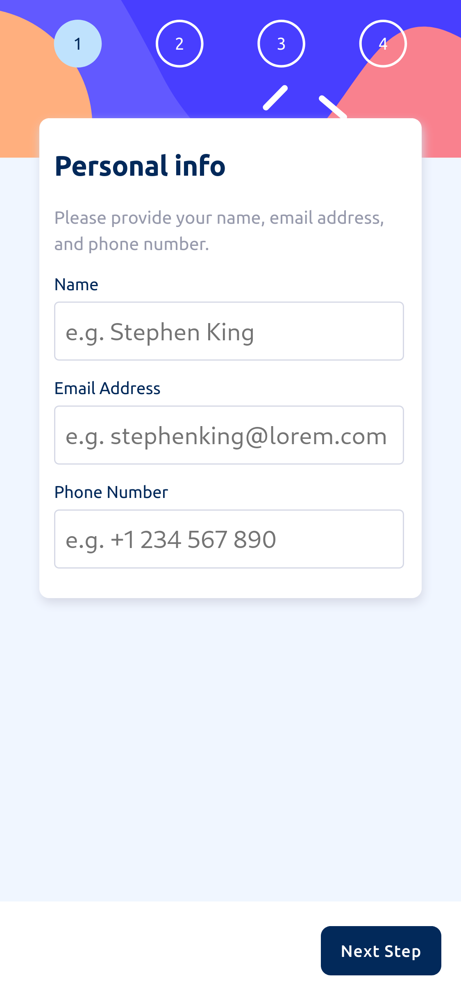
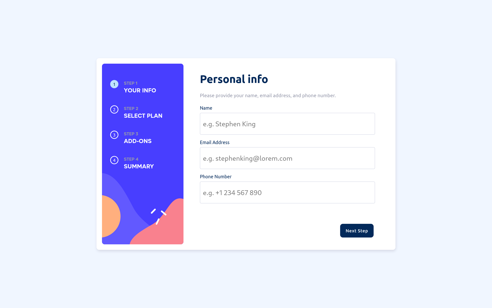

# Frontend Mentor - Multi-step form solution

This is a solution to the [Multi-step form challenge on Frontend Mentor](https://www.frontendmentor.io/challenges/multistep-form-YVAnSdqQBJ). Frontend Mentor challenges help you improve your coding skills by building realistic projects.

## Table of contents

- [Overview](#overview)
  - [The challenge](#the-challenge)
  - [Screenshot](#screenshot)
  - [Links](#links)
- [My process](#my-process)
  - [Built with](#built-with)
  - [What I learned](#what-i-learned)
  - [Continued development](#continued-development)
  - [Useful resources](#useful-resources)
- [Author](#author)


## Overview

### The challenge

Users should be able to:

- Complete each step of the sequence
- Go back to a previous step to update their selections
- See a summary of their selections on the final step and confirm their order
- View the optimal layout for the interface depending on their device's screen size
- See hover and focus states for all interactive elements on the page
- Receive form validation messages if:
  - A field has been missed
  - The email address is not formatted correctly
  - A step is submitted, but no selection has been made

### Screenshot




### Links

- Solution URL: [The github Repository](https://github.com/jay-ike/multiple-step-form)
- Live Site URL: [github page](https://jay-ike.github.io/multiple-step-form)

## My process

### Built with

- Semantic HTML5 markup
- CSS custom properties
- Flexbox
- CSS Grid
- Mobile-first workflow
- DOM Scripting with javascript

### What I learned

we can use HTML to save a set of attributes which will be used in javascript
with the *dataset* attribute of an element

```html
<input type="radio" name="value" data-cost="3"/>
```

In css I've found a really mind-blowing trick with custom property to toggle a
property without javascript

```css
selector {
    --item: var(--default);
    --default: var(--item,);
    --option1: var(--item,);
    --option2: var(--item,);
    property: var(--default, defaultvalue)
              var(--option1, value1)
              var(--option2, value2);
}
```
The trick here is that when we cross reference custom properties *--item* and
*--default* both are invalid so *--option1* and *--option2* will fallback to
empty value and now only that value will fallback to *defaultvalue* in the
default state
and when you want to change the state just do
*--item: var(--option1)* to pass to the value in the state of option1

In javascript we can listen to DOM modification with MutationObserver

```js
function callback(mutationList) {
    Array.from(mutationList).forEach(function (mutation) {
        /* we can now know what happened to the part of the DOM we are listening */
        console.log('🎉')
    });
}
const observer = new MutationObserver(callback);
observer.observe(node, {attributes: true, childList: true, subtree: true});
/* now we are listening to any attribute change, childList change and subtree change*/
```

### Continued development

We can still improve the project with handling dark mode with color-scheme

### Useful resources

- [cyclic dependency toggle trick](https://kizu.dev/cyclic-toggles) - This helped me to manage the billing type toggle more easily without too much relying on javascript (I highly recommend reading roman komarov blog because he has enabled me to bypass my fear of reading the specs)
- [Mozilla developer network](https://developer.mozilla.com) - This is where I usually go when looking for documentation even though for more in-depth knowledge I recommend reading the specifications


## Author

- Website - [Ndimah Tchougoua](https://www.github.com/jay-ike)
- Frontend Mentor - [@jay-ike](https://www.frontendmentor.io/profile/jay-ike)
- Twitter - [@jospinEvans](https://www.twitter.com/jospinEvans)

